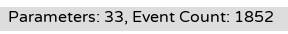
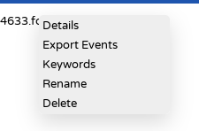
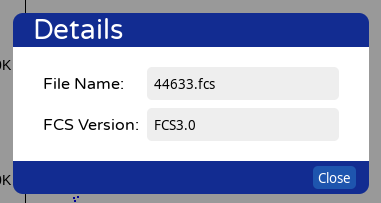
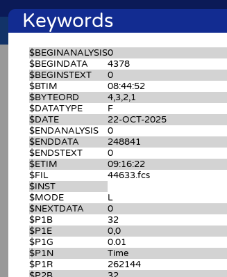

```{r setup}
#| output: false
library(flowCore)
library(magrittr)
library(glue)
library(tibble)
library(dplyr)
library(tidyr)
library(stringr)
library(purrr)

# Default printing causes problems when there are dollar signs in the table.
# In those cases use the below function instead of the default method
mykable <- function(df) knitr::kable(df, escape = TRUE, format = "html")
```


## Problem 1

> Today’s walkthrough focused on a raw spectral flow cytometry file. Within a subfolder in data you will also find an unmixed .fcs file (2025_07_26…). Using what learned to day, investigate it, and see if you can catalog the main differences that occured to the keyword, parameters and exprs. Did any keywords get added, changed, deleted entirely? etc.


```{r}
#| label: Filenames
filename1 <- "data/CellCounts4L_AB_05_ND050_05.fcs"
filename2 <- "data/AdditionalFCSFiles/2025_07_26_AB_02_NY068_02_Ctrl.fcs"
```


```{r}
#| label: Load files
flow_frame1 <- read.FCS(filename=filename1, transformation = FALSE, truncate_max_range = FALSE)
flow_frame2 <- read.FCS(filename=filename2, transformation = FALSE, truncate_max_range = FALSE)
```

```{r}
flow_frame1
```

MFI = mean/median fluorescence intensity

```{r}
flow_frame2
```

For the second file the description column is empty only for those scatter things.
In this case of unmixed .fcs file the name column contains the fluorophore or metal name and the desc column
contains the name of the biomarker we are interested in.

### exprs

```{r}
e1 <- exprs(flow_frame1)
e2 <- exprs(flow_frame2)
```

```{r}
glue("file1: expr has {ncol(e1)} observables and {nrow(e1)} cells\n")
glue("file2: expr has {ncol(e2)} observables and {nrow(e2)} cells\n")
```

The column names differ, but the index names of column names are the same:

```{r}
df1 <- tibble(id = names(colnames(e1)), name1 = colnames(e1))
df2 <- tibble(id = names(colnames(e2)), name2 = colnames(e2))
df <- full_join(df1, df2, by="id")
mykable(df)
```

### Parameters

#### varMetadata

The varMetadata of the parameters are the same for flow frames:

```{r}
parameters(flow_frame1)@varMetadata
parameters(flow_frame2)@varMetadata
```

#### data

In the parameters@data slot the range columns are the same except for Time. For other columns there are
differences.

```{r}
x <- full_join(
    as_tibble(parameters(flow_frame1)@data, rownames="id") %>% select(-desc),
    as_tibble(parameters(flow_frame2)@data, rownames="id") %>% select(-desc),
    by="id") %>%
    relocate(id, name.x, name.y, range.x, range.y, minRange.x, minRange.y, maxRange.x, maxRange.y)
mykable(x)
```

#### dimLabels and classVersion

No differences in the dimLabels and __classVersion__ slots:

```{r}
flow_frame1@parameters@dimLabels
flow_frame2@parameters@dimLabels
```


```{r}
flow_frame1@parameters@.__classVersion__
flow_frame2@parameters@.__classVersion__
```

### Description

```{r}
dl1 <- keyword(flow_frame1)
dl2 <- keyword(flow_frame2)
```

```{r}
names(dl1)
```

```{r}
names(dl2)
```

```{r}
glue("file1: description list contains {length(dl1)} keywords")
glue("file2: description list contains {length(dl2)} keywords")
```

#### Metadata

Eight metadata values changed:

```{r}
init1 <- dl1[1:19] 
init2 <- dl2[1:19] 
x1 <- dl1[1:19] %>% enframe() %>% unnest(value)
x2 <- dl2[1:19] %>% enframe() %>% unnest(value)
df <- inner_join(x1, x2, by="name")
df %>% filter(value.x != value.y) %>% mykable()
```

#### Observables

Information about observables:

```{r}
#dl1[20:384] %>% names()  # Each observable has 6 descriptions, except time has only 5
parse_observables <- function(description_list) {
    df <- description_list %>% 
        enframe("keyword") %>%
        separate_wider_regex(keyword, c("\\$P", i="[0-9]+", letters="[A-Z]+"), cols_remove = FALSE) %>% 
        unnest(value) %>%
        pivot_wider(names_from=letters, values_from=value, id_cols=i) %>%
        mutate(i = as.integer(i)) %>% 
        arrange(i)
    df
}
df1 <- parse_observables(dl1[20:384])
df2 <- parse_observables(dl2[20:308])
df1
```

How many detectors of each color do we have?

```{r}
tmp <- df1 %>% select(N, TYPE) %>% filter(N != "Time")
tmp %>% mutate(color = str_extract(N, "^[A-Z]+") %>% 
    replace_values("R" ~ "Red", 
    "UV" ~ "Ultra violet",
    "V" ~ "Violet",
    "B" ~"Blue"
    )) %>%
        count(TYPE, color)
```

In the second file the detectors are named completely differently.

```{r}
df2 %>% count(TYPE)
```

The second file has in addition the "S" value for each observable, except for observables listed below.

```{r}
colnames(df1)
colnames(df2)
```

Which observables have missing values for some letter.

```{r}
df1 %>%
    filter(if_any(-i, is.na))   # Show rows that have at least one NA value
df2 %>% 
    filter(if_any(-i, is.na))   # Show rows that have at least one NA value
```

#### Middle metadata

```{r}
middle1 <- dl1[385:398] %>% discard_at("$SPILLOVER")
middle1
```

```{r}
middle2_all <- dl2[309:408] %>% discard_at("$SPILLOVER")
middle2 <- middle2_all %>% discard_at(~str_starts(., "flowCore_"))
middle2
```

File2 has lots of keywords that start with string flowCore_. Don't know what these are.

```{r}
middle2_all %>% keep_at(~str_starts(., "flowCore_"))
```

#### Laser metadata


```{r}
laser1 <- dl1 %>% keep_at(~ str_starts(., "LASER"))
laser2 <- dl2 %>% keep_at(~ str_starts(., "LASER"))
glue("file1: {length(laser1)} laser keywords")
glue("file1: {length(laser1)} laser keywords")
```

#### Display


```{r}
display1 <- dl1 %>% keep_at(~ str_ends(., "DISPLAY"))
display2 <- dl2 %>% keep_at(~ str_ends(., "DISPLAY"))
bind_rows(
    tibble(file="file1", display=as.character(display1)),
    tibble(file="file2", display=as.character(display2))
) %>% table()
```

#### Last few keywords


```{r}
last1 <- dl1[473:476]
last2 <- dl2[468:472]
full_join(
    enframe(last1) %>% unnest(value),
    enframe(last2) %>% unnest(value),
    by="name"
)
```

The transformation keyword has been added in the second file.

## Problem 2

> Today’s files were for spectral .fcs files from a Cytek Aurora within a subfolder in data you will also find a conventional flow cytometry file (2025-10_22…). Similarly, explore and see if you find any major differences (beyond the different detector or fluorophore names which will vary based on antibody panel used, etc)

```{r}
filename3 <- "data/AdditionalFCSFiles/2025-10_22_Contrad.fcs"
```


```{r}
flow_frame3 <- read.FCS(filename=filename3, transformation = FALSE, truncate_max_range = FALSE)
flow_frame3
```

### exprs

```{r}
e3 <- exprs(flow_frame3)
```

```{r}
glue("file3: expr has {ncol(e3)} observables and {nrow(e3)} cells\n")
```

### Parameters

#### varMetadata

```{r}
parameters(flow_frame3)@varMetadata
```

#### data

```{r}
x <- as_tibble(parameters(flow_frame3)@data, rownames="id") %>% select(-desc)
mykable(x)
```

#### dimLabels and classVersion

```{r}
flow_frame3@parameters@dimLabels
flow_frame3@parameters@.__classVersion__
```

### Description

```{r}
dl3 <- keyword(flow_frame3)
names(dl3) %>% head(n=40)
names(dl3) %>% tail(n=5)
```


```{r}
glue("file3: description list contains {length(dl3)} keywords")
```

#### Initial metadata

```{r}
init3 <- dl3[1:34]
init3
```

#### Observables

```{r}
observable_list3 <- dl3[35:327] 
```

Those keywords that start with dollar sign.

```{r}
x <- parse_observables(observable_list3 %>% keep_at(~ str_starts(., "\\$")))
x
```

Instead of TYPE we have G.

Those keywords that don't start with a dollar sign.

```{r}
observable_list3 %>% keep_at(~ ! str_starts(., "\\$")) %>% head()
```

The DISPLAY keywords were in different place than in the first two files.
Keywords of the form P33BS and P33MS did not appear in the first two files.

#### Laser metadata

No information about lasers.

#### Last few keywords


```{r}
last3 <- dl3[328:330]
last3
```

Compensation is applied only to the third file.

```{r}
c(dl1$`APPLY COMPENSATION`, dl2$`APPLY COMPENSATION`, dl3$`APPLY COMPENSATION`)
```

### All metadata


```{r}
all1 <- c(init1, middle1, last1) %>% enframe(value = "file1") %>% unnest(file1)
all2 <- c(init2, middle2, last2) %>% enframe(value = "file2") %>% unnest(file2)
all3 <- c(init3, last3) %>% discard_at("SPILL") %>% enframe(value = "file3") %>% unnest(file3)
```


```{r}
all <- all1 %>%
    full_join(all2, by="name") %>%
    full_join(all3, by="name")
```

```{r}
mykable(all)
```

Sample volume in nanoliters is not given for the last file.

```{r}
all %>% filter(name == "$VOL")
```

Last file has much larger number of cells:

```{r}
all %>% filter(name == "$TOT")
```

These differ as well. Not sure what they mean.

```{r}
all %>% filter(name %in% c("$TIMESTEP", "FSC ASF", "THRESHOLD"))
```

## Problem 3

> If you have access to commercial software, take one of the .fcs files and try to see if you can see similar internal information from within the software. For those without commercial access, try the equivalent process using Floreada.io.

I used Floreada.io.

The number of observables and cells can be found on the bottom of the screen:



By right clicking the filename a menu appears:



Not much details:



A list of all keywords:



By selecting the Export events choice the actual intensities can
be saved to a spreadsheet file or opened in a spreadsheet program.


