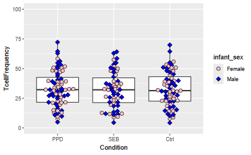
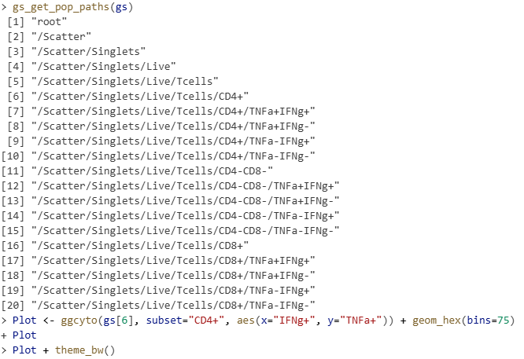
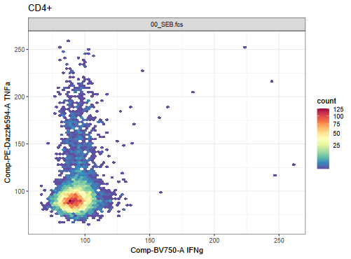
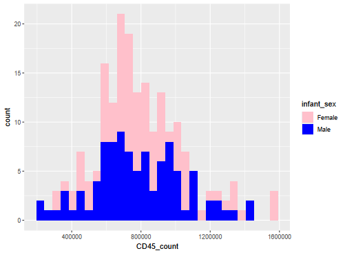

# Problem 1

In this session, we created beeswarm-style boxplot to display our T-cell frequencies on the y-axis, and timepoint on the x-axis. Using the concepts covered this week, swap out “timepoint” for the “Condition” variable. Adjust other layer arguments accordingly until you can return a similar plot at the end of the class. Finally, figure out how to switch around the order the Condition values are displayed on the x-axis.

# Answer 1

# Problem 2

Circle back to the CytoML-ggcyto flowplot, and modify it until happy with the visual appearance. You may use any resource on the internet to assist, but you must document your steps so that we can also repeat them.

# Answer 2

# Problem 3

In Mismatched Assumptions, we saw two examples of a histogram/density overlay showing the distribution of a variable on the x-axis. Similar to what we did during class to show values according to a different data column, try to modify the plot to show data on the basis of group (whether condition, ptype, infant_sex, etc.) similar to what you can see here

# Answer 3

